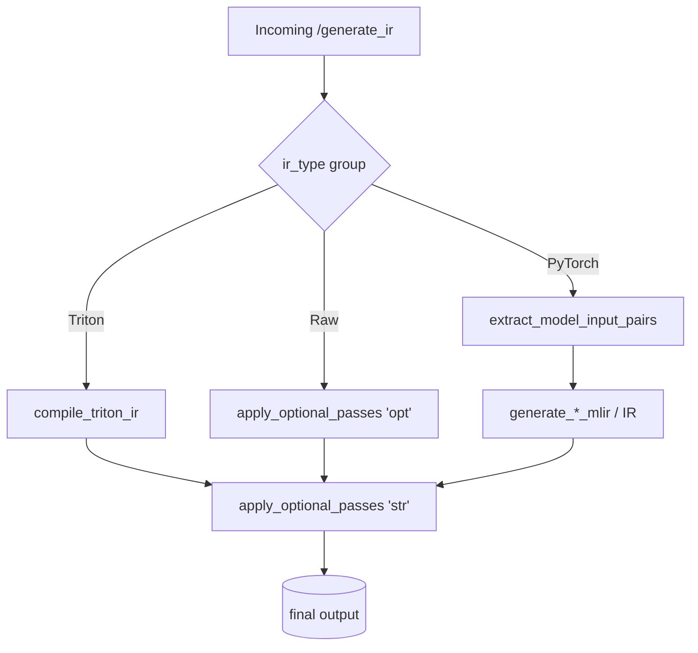

# PyTorch Explorer — Integration Guide
*(last updated : 2025-06-04, commit: 5c5c42)*

This document explains **how to integrate with the PyTorch explorer as IR-Playground compiler
service**—either by

* building **your own frontend** that talks to the reference backend, or
* writing **a compatible backend** that the existing (or other) frontends can use.

---

## 0. ️**High-level picture**

| Part | Tech | Port | Auth | Spec |
|------|------|------|------|------|
| **Backend** (reference) | FastAPI + Torch + Torch-MLIR + Triton | **8000** | none (CORS `*`) | this file |
| **Frontend** (reference) | React / Monaco / Ant-Design | n/a | — | `src/app/ExplorerContent.js` |

**Two HTTP POST endpoints** drive everything:

| Path | Purpose |
|------|---------|
| `/generate_ir` | Compile (or translate) user code (or raw IR) into the requested IR, run an optional transformation pipeline and return the textual dump. |
| `/free_ir_cache` | Tell the backend you’re done using a Triton example, so its on-disk cache can be removed early. Note, as of right now Triton support is experimental. |

---

## 1. ️**Environment variables (backend)**

| Variable | Meaning | Typical value |
|----------|---------|---------------|
| `TORCH_MLIR_OPT_PATH` | Directory ending with `/` that contains `torch-mlir-opt` | `/opt/llvm/bin/` |
| `LLVM_BIN_PATH` | Directory that contains `mlir-opt`, `mlir-translate`, `opt`, `llc` | `/opt/llvm/bin/` |
| `TRITON_OPT_PATH` | Directory that contains `triton-opt`, `triton-llvm-opt` | `/opt/triton/bin/` |

If unset, the backend assumes the tools are discoverable on `$PATH`.

---

## 2. ️**JSON API**

### 2.1.  `POST /generate_ir`

```ts
// request
{
  "code": "string",                // required – user code OR raw IR
  "ir_type": "...",                // see table §3
  "selected_language": "pytorch" | "triton" | "raw_ir",   // default "pytorch",

  // Optional pipeline fields (each is a *string* – flags for that tool.
  // Use `&&` to chain multiple invocations):
  "torch_mlir_opt": "",
  "mlir_opt": "",
  "mlir_translate": "",
  "llvm_opt": "",
  "llc": "",
  "triton_opt": "",
  "triton_llvm_opt": "",
  "user_tool": "",          // first token must be an executable in $PATH
  "dump_after_each_opt": false
}
```

| Field                       | Required | Notes                                                                                    |
| --------------------------- | -------- | ---------------------------------------------------------------------------------------- |
| `code`                      | Y        | Python snippet (PyTorch / Triton) **or** raw textual IR.                                 |
| `ir_type`                   | Y        | Dialect / target you want back (see §3).                                                 |
| `selected_language`         | Optional | Needed only when `ir_type == "raw_ir"` (to decide if the backend must execute the code). |
| `*_opt`, `llc`, `user_tool` | Optional | Build a custom optimisation pipeline; order is fixed as listed.                          |
| `dump_after_each_opt`       | Optional | If **true** the backend inserts delimiters so you can inspect IR *after every pass*.     |

#### Response shape

Success 200 OK

```ts
{
  "status": "ok",
  "output": "<textual IR dump>"
}
```

Failure 200 OK

```ts
{
  "status": "error",
  "message": "human-readable summary",
  "detail":  "full Python traceback (useful for debugging)"
}
```

### 2.2. POST /free_ir_cache

```ts
// request
{ "code": "<same code string sent earlier>" }

// response
{ "status": "ok" }
```

Calling this is optional but keeps /tmp tidy on long-running servers.

## 3. ️**ir_type catalogue**

| Group | Value | Generated from | Notes |
|-------|-------|----------------|-------|
| PyTorch family | torch_script_graph_ir | torch.jit.trace(...) | |
|  | torch_mlir | Torch-MLIR exporter | |
|  | tosa_mlir | Torch-MLIR -> TOSA | |
|  | linalg_on_tensors_mlir | Torch-MLIR -> Linalg-on-Tensors | |
|  | stablehlo_mlir | Torch-MLIR -> StableHLO | |
|  | llvm_mlir | Linalg-on-Tensors -> LLVM dialect | |
|  | llvm_ir | mlir-translate --mlir-to-llvmir | |
|  | nvptx / amdgpu / spirv | LLVM IR -> llc | |
| Triton | triton_ir | Triton compiler dump (*.ttir) | |
|  | triton_gpu_ir | *.ttgir | |
|  | triton_llvm_ir | *.llir | |
|  | triton_nvptx | *.ptx | |
| Raw | raw_ir | Echo-style (no generation) | |

## 4. ️**Backend internals (reference implementation)**

### 4.1. Compilation flow (simplified)



### 4.2. apply_optional_passes

Accepts an initial IR string, a pipeline array [(tool, flags), …], and dump_each.

Writes IR to a temp file -> for each stage choose executable, run it, collect stderr, append delimiters if dump_each == true.

Cleans temp files afterwards.

Tool alias -> binary mapping:

| Alias | Binary (${ENV_PATH}…) | Extra behaviour |
|-------|------------------------|-----------------|
| torch-mlir-opt | torch-mlir-opt | — |
| mlir-opt / mlir-translate | mlir-opt / mlir-translate | — |
| opt | opt | Adds -S automatically |
| llc | llc | — |
| triton-opt | triton-opt | — |
| triton-llvm-opt | triton-llvm-opt | — |
| user-tool | First token in flags | Remaining tokens become new flags |

Delimiter pattern for frontend parsing:

```
===== Initial IR =====
<text>

===== IR after <tool> <flags> =====
<text>
```

## 5. ️**Building your own frontend**

### Generate IR

```bash
curl -X POST http://localhost:8000/generate_ir      -H 'Content-Type: application/json'      -d '{
           "code": "...python or ir...",
           "ir_type": "torch_mlir",
           "mlir_opt": "--convert-scf-to-cf --reconcile-unrealized-casts",
           "dump_after_each_opt": true
         }'
```

### Display intermediate stages

Split output on the regex

```regex
/^===== IR after [\s\S]*? =====$/m
```

The reference React UI’s “🔍 explore” feature does exactly that.

### Free Triton cache (optional)

```bash
curl -X POST http://localhost:8000/free_ir_cache      -H 'Content-Type: application/json'      -d '{ "code": "...same code string..." }'
```

CORS is open (allow_origins="*"), so browser SPAs work out-of-the-box.

Error handling – Check status. On "error" show message; expose detail behind a disclosure panel for power users.

## 6. ️**Writing your own backend (keep clients happy)**

- Keep endpoints & schemas identical to §2.
- You may add fields but never break existing ones.

**Preserve delimiters**
Emit the exact marker strings so frontends can split IR dumps.

**Graceful unsupported dialects**
If you omit a value from §3, return:

```ts
{ "status": "error",
  "message": "IR type not supported",
  "detail": "" }
```

**Long-running compilations**
Either stay synchronous or expose a new `/status/<jobid>` endpoint—but keep `/generate_ir` behaviour unchanged.

**Security & user_tool**
If you disallow arbitrary executables just refuse with `"status":"error"`.

**Triton cache semantics**
Your caching key must be the raw code string so `/free_ir_cache` continues to work.

**Version endpoint (optional but handy)**

```http
GET /version  ->  "ir-backend 1.1.0-rust"
```

## 7. ️**Extending the reference backend**

- New dialect -> implement `generate_<dialect>()`, register it in `process_model`, add value to §3 and to the frontend dropdown.
- New compiler tool -> add a clause in `apply_optional_passes`.
- Timeouts / resource limits -> see `compile_triton_ir(... timeout=20)`.

## 8. ️**Appendix — 20-line TypeScript helper**

One can use the following TS helper as an example:

```ts
export async function generateIR(req: Record<string, unknown>): Promise<string> {
  const r = await fetch("http://localhost:8000/generate_ir", {
    method: "POST",
    headers: { "Content-Type": "application/json" },
    body: JSON.stringify(req),
  }).then(r => r.json());

  if (r.status !== "ok") throw new Error(r.message);
  return r.output as string;
}
```

or full mock page.js implementation:

```ts
"use client";

import React, { useEffect } from "react";

export async function generateIR(req) {
  const r = await fetch("http://localhost:8000/generate_ir", {
    method: "POST",
    headers: { "Content-Type": "application/json" },
    body: JSON.stringify(req),
  }).then(r => r.json());

  if (r.status !== "ok") throw new Error(r.message);
  return r.output;
}

export default function IRTest() {
  useEffect(() => {
    const code = `
import torch
import torch.nn as nn

class MyModel(nn.Module):
    def __init__(self):
        super().__init__()
        self.linear = nn.Linear(4, 4)

    def forward(self, x):
        return torch.relu(self.linear(x))

model = MyModel()
example_input = torch.randn(4, 4)
    `.trim();

    generateIR({
      code,
      ir_type: "torch_mlir",
    })
      .then(output => console.log("IR output:", output))
      .catch(err => console.error("Error:", err));
  }, []);

  return <div>Check the browser console for IR output</div>;
}
```

Happy hacking 🎉 — Contributions & PRs welcome!
